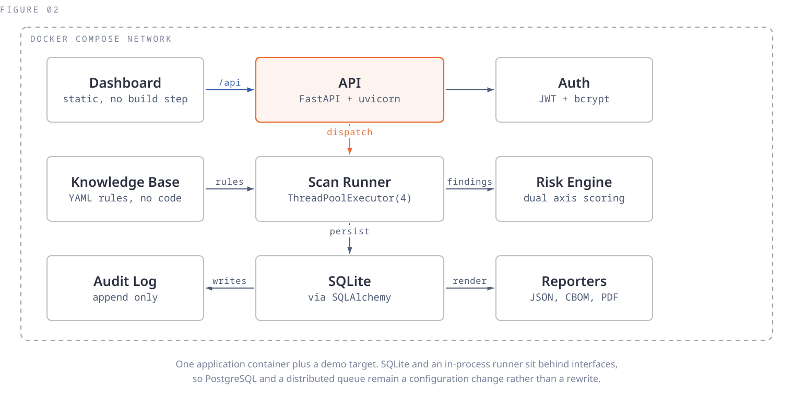
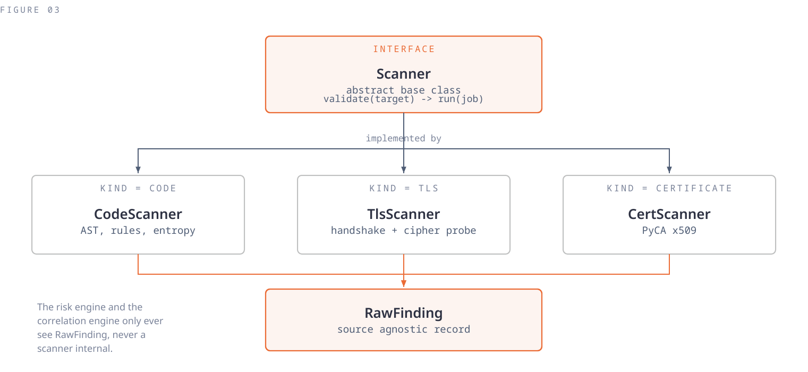

# ECDAT

**Enterprise Cryptographic Discovery and Analysis Tool.**

One scan across source code, TLS endpoints and X.509 certificates, producing a
single risk-scored cryptographic inventory with post-quantum migration
readiness measured against the NIST transition deadline.

Smart India Hackathon 2026, problem statement SIH26164.

---

## The problem

Ask any organisation what cryptography it is actually running and nobody can
answer. Not because they do not care, but because nothing tells them.

Cryptography is not a setting you can read off a config file. It is a library
call buried three functions deep, written by someone who left years ago, and it
hides in three separate places: the code, the TLS configuration on every
server, and the certificate store. Three places, usually three different teams,
and no single system that looks at all three.

Good tools exist for each place individually. Semgrep reads source and has
never seen your servers. SSLyze scans TLS and has never seen a line of your
code. **Not one of them can tell you that the RSA key in your repository is the
same key in the certificate on that host**, because none of them see both.

So the inventory gets built by hand, in a spreadsheet, and it is out of date the
day after it is finished.

## What ECDAT does

| | |
|---|---|
| **Discovers** | Source code, TLS endpoints, X.509 certificates, in one pass |
| **Normalises** | Every scanner emits one record type, so results are comparable |
| **Correlates** | Links assets across sources by shared key material and hostname |
| **Scores** | Two independent axes, classical and quantum, never averaged |
| **Reports** | Native JSON, CycloneDX 1.6 CBOM, and PDF |

---

## Quickstart

```bash
git clone https://github.com/ankamteja/ecdat.git
cd ecdat
docker compose up --build
```

Open <http://localhost:8000> and sign in with `admin` / `ecdat-demo`.

That is the entire quickstart. There is no `npm install` and no build step: the
dashboard is static files served by the API.

The stack also starts a **deliberately weak TLS endpoint** so the network
scanner can be demonstrated without pointing it at anything on the internet.
Scan `weak-tls:8443` from the dashboard to see it.

### Running without Docker

```bash
pip install -r requirements.txt
cd backend && uvicorn app.main:app --reload
```

---

## A five minute tour

1. **New scan** against `../samples/vulnerable-repo`. Roughly 28 findings across
   Python, Java and JavaScript.
2. **New scan** against `../samples/certs`. SHA-1 signatures, a 1024 bit RSA
   key, an expired certificate, a missing SAN.
3. **Inventory**. Both sources in one asset-by-algorithm matrix, plus the
   cross-source correlation linking `config/tls_pinning.py` to
   `cert:api.ecdat.sample` by shared public key fingerprint.
4. **PQC readiness**. A migration table with a countdown to the NIST deadline.
5. **Reports**. PDF for people, CycloneDX CBOM for other tools.

Try submitting a TLS scan with authorisation unticked. It is refused, and the
refusal is written to the audit trail.

---

## The scoring model

There is no CVSS for cryptographic weakness. MITRE's own CWSS documentation
names the consequence: every scanner invents its own scoring, so tools disagree
with each other.

So this model is **assembled from published work rather than invented**:

| Borrowed | From |
|---|---|
| Structure: metric groups, confidence in the finding | MITRE CWSS |
| Mechanics: weighting, banding, cap rules | Qualys SSL Labs rating guide |
| Quantum timeline: 2030 deprecated, 2035 disallowed | NIST IR 8547 ipd |
| Algorithm status | NIST SP 800-131A Rev 2, FIPS 180-4 / 197 / 203 / 204 / 205 |
| Finding taxonomy | CWE-310, CWE-326, CWE-327 |

```
classical = clamp(base_classical + param_penalty, 0, 10) * w_context * w_exposure
quantum   = base_quantum                                 * w_context * w_exposure
severity  = band(max(classical, quantum))    subject to cap rules
```

**The two axes are never averaged.** RSA-2048 scores 3.0 classical and 9.5
quantum. A blended 6.25 would band as MEDIUM and the finding would disappear,
which is exactly the failure this tool exists to correct.

Full detail in [`docs/SCORING.md`](docs/SCORING.md).

### What that produces

The same `hashlib.md5` call, scored differently by where it lives:

| Location | Classical | Quantum | Severity |
|---|---|---|---|
| Signing an auth token in a service | 10.0 | 4.0 | **CRITICAL** |
| Building a cache key under `tests/` | 3.0 | 1.2 | **LOW** |

Context is the difference between an inventory and an alert storm.

---

## Architecture



Three scanners behind **one interface**. Every scanner returns the same
source-agnostic record, so the risk engine cannot tell whether a finding came
from a file, a socket or a certificate. That is what makes the unified
inventory structural rather than three scripts sharing a folder, and it is why
a fourth scanner drops in without the scoring engine changing.



Detection, enrichment and policy are kept separate. Scoring rules live in YAML
under `backend/app/knowledge/`, not in code, so an organisation can tune ECDAT
to its own policy without forking the scanners.

All eleven diagrams and the reasoning behind each decision are in
[`docs/ARCHITECTURE.md`](docs/ARCHITECTURE.md).

---

## Security properties

| Property | How it is enforced |
|---|---|
| Key material never stored in full | Path, line, entropy, first four characters and a truncated SHA-256 fingerprint. The literal is never persisted, logged or exported |
| Audit log is append only | No UPDATE or DELETE path exists in any router, service or helper |
| Authorisation before any network scan | 403 unless explicitly authorised, and the refusal is recorded |
| Non-root container | uid 10001, application tree owned by root and not writable |
| Offline capable | Rules and schemas bundled; the only outbound connection is to the scan target |

**The audit record is written before the action, not after.** A log written
afterwards contains only the scans that finished. One written first contains
every scan that was attempted, including the refused ones. Only the second is
an audit trail.

---

## Testing

```bash
pytest
```

71 tests, about three seconds. The golden cases in `tests/test_risk.py` pin the
scoring model: if one fails, the model changed, and that should be deliberate.

The suite is organised around the three questions the NCCoE functional test
plan for discovery tools poses (NIST SP 1800-38B): does the tool find what is
there, does it avoid reporting what is not, and is the result usable as a
managed asset.

---

## Limitations

Stated plainly, because they are easier to find than to hide.

| Limitation | Detail |
|---|---|
| Custom or obfuscated cryptography | No signature to match. Flagged for manual review rather than guessed at. Binary analysis is roadmap |
| Runtime algorithm selection | An algorithm chosen from a config value at execution time is invisible to static analysis. An agent is roadmap |
| Air-gapped hosts | Unreachable by a network scanner. ECDAT augments a human audit, it does not replace one |
| 3DES and RC4 cipher probing | Modern OpenSSL removes these from the client, so they cannot be offered. The scan reports this as an explicit coverage gap rather than silently omitting it |
| Multi-language AST | Real syntax tree analysis covers Python. Other languages use pattern rules. Every finding records which pass produced it, so no report overstates its method |

## Roadmap

Semgrep and tree-sitter for full multi-language AST coverage, SSLyze with its
bundled OpenSSL fork for complete cipher enumeration, Ghidra for binary
analysis, a runtime agent, multi-host sweeps, PostgreSQL and a distributed
queue, and CI/CD gating. The webhook route exists and returns 501 rather than
pretending to work.

---

## Documentation

| Document | Contents |
|---|---|
| [`docs/ARCHITECTURE.md`](docs/ARCHITECTURE.md) | Eleven diagrams and the decisions behind them |
| [`docs/SCORING.md`](docs/SCORING.md) | The scoring model, its sources, and worked examples |
| [`docs/API.md`](docs/API.md) | Every endpoint with request and response shapes |
| [`CONTRIBUTING.md`](CONTRIBUTING.md) | Development setup and conventions |

Interactive API documentation is at `/docs` on a running instance.

## Licence

MIT. See [`LICENSE`](LICENSE).

Bundled fonts (Public Sans, Space Mono) are SIL Open Font License 1.1; see
`backend/app/static/fonts/OFL.txt`.
