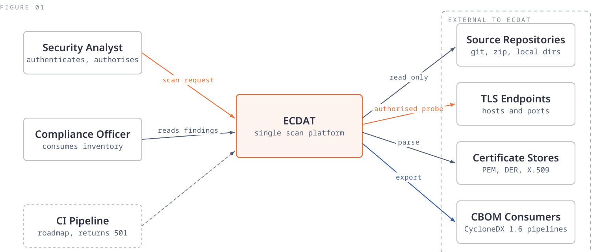
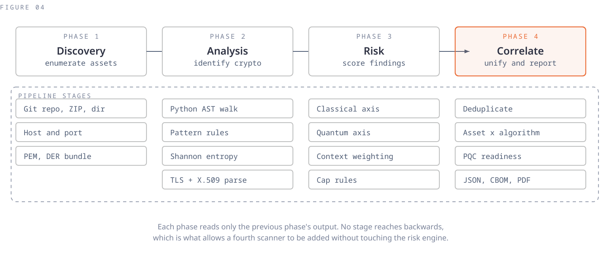
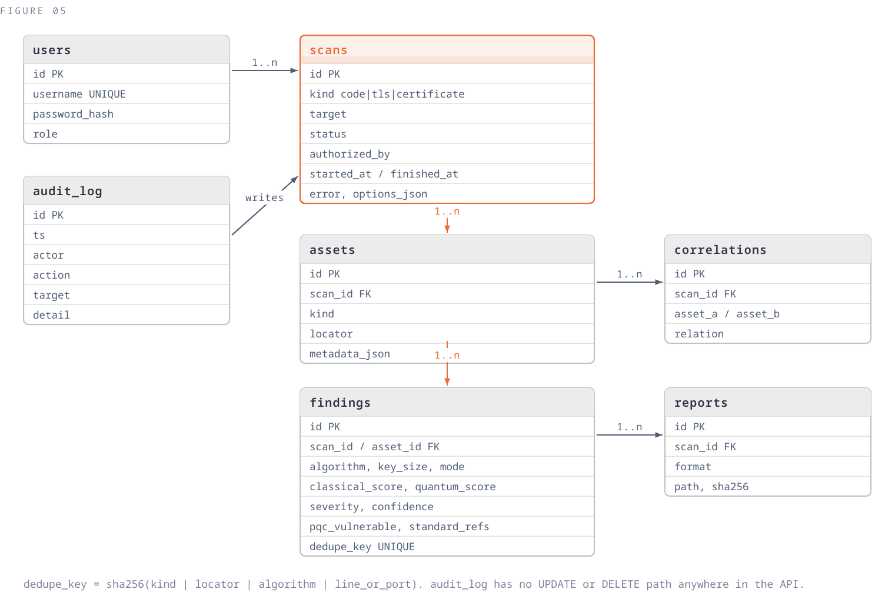
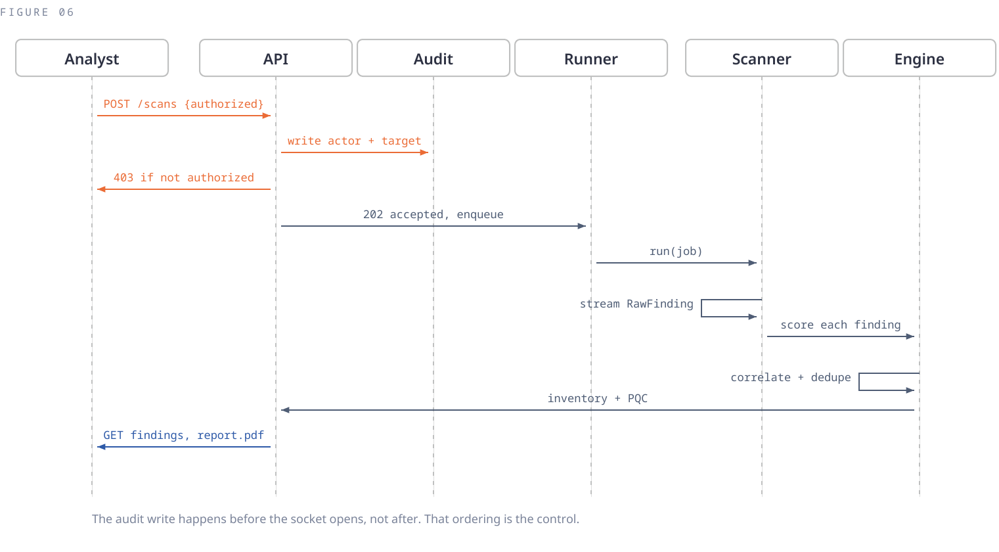
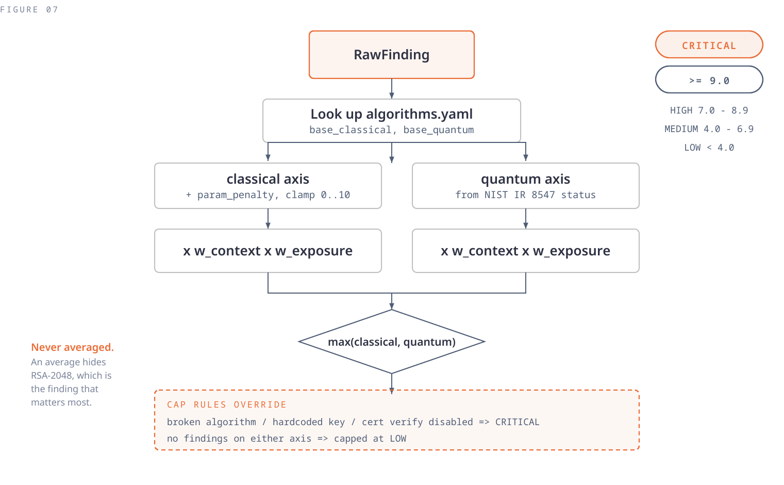
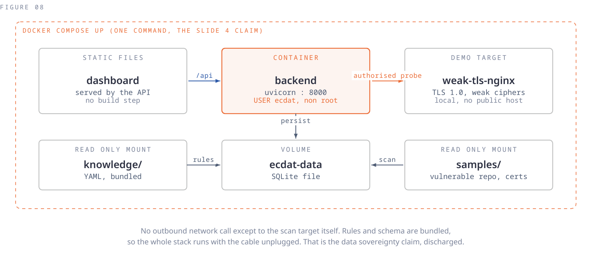
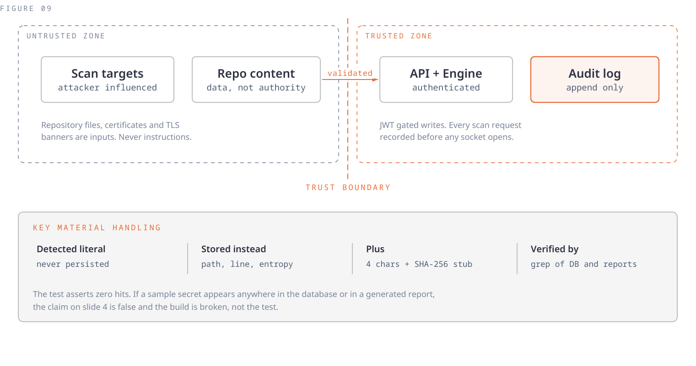
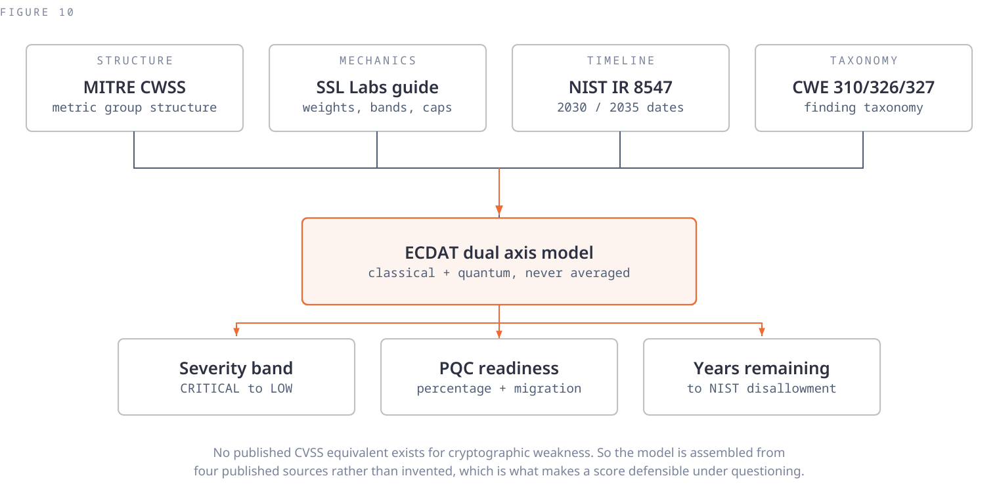
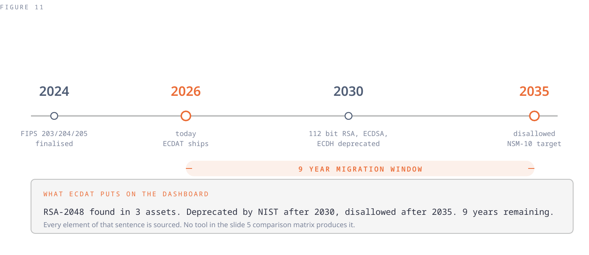

# Architecture

Eleven views of the system, and the reasoning behind the decisions that are not
obvious. Diagrams are generated from code in `docs/diagram-src/` so they can be
diffed and corrected when the implementation changes; regenerate with
`python3 docs/diagram-src/build.py`.

---

## 1. System context



ECDAT sits between people who need to know what cryptography an organisation
runs and the three places that answer lives. Nothing here is novel on its own.
What is novel is that one system spans all three and produces one inventory
rather than three reports somebody has to reconcile by hand.

The CI pipeline is drawn dashed because it is roadmap. The route exists and
returns 501 with a roadmap message, which reserves the path without pretending
the integration works.

The arrow into TLS endpoints is the only one that leaves the trust boundary and
touches something that can be harmed. That is why the authorisation control in
view 6 exists, and why the demonstration target ships inside the compose file.

## 2. Containers


The conventional shape for this workload is five containers: frontend, API,
worker, PostgreSQL and Redis. That shape is rejected here. Each additional
container is operational surface, and none of them produce anything a user can
see at this scale.

SQLite sits behind SQLAlchemy, so moving to PostgreSQL is a change to
`ECDAT_DATABASE_URL`. The scan runner sits behind an interface with `submit()`
as its only entry point, so a distributed broker replaces one function. Both
are reversible decisions, documented rather than hidden.

**Detection, enrichment and policy are kept separate:**

| Layer | Lives in | Consequence |
|---|---|---|
| Detection | `scanners/` | A new source is a new class, not a change to the engine |
| Enrichment | `engine/correlate.py` | Cross-source linking is in one place |
| Policy | `knowledge/*.yaml` | Changing a threshold is a data edit, never a redeploy |

## 3. Scanner interface


The claim that ECDAT unifies three sources is only credible if the scanners are
genuinely one system rather than three scripts sharing a folder. This interface
is the difference.

```python
class Scanner(ABC):
    kind: Literal["code", "tls", "certificate"]

    def validate(self, job: ScanJob) -> None:
        """Raise on a malformed or unauthorised target, before any work."""

    def run(self, job: ScanJob) -> Iterator[RawFinding]:
        """Stream findings. Never buffer the whole target."""
```

`RawFinding` is deliberately source-agnostic. A locator is a repository path, a
host and port, or a certificate fingerprint, and nothing downstream needs to
know which. That is what lets a fourth scanner for binaries or a running
process be added without the risk engine changing at all.

## 4. Four phase data flow



Phases one and two run per source. Phase three runs per finding. Phase four is
the only stage that sees everything at once, and it is where the product claim
is realised: deduplication, the asset-by-algorithm matrix, cross-source linking,
and report generation.

The deduplication key is `sha256(kind | locator | algorithm | rule | line)`. It
is stable across runs, so re-scanning an unchanged target reproduces the same
inventory rather than a growing pile of duplicates. The uniqueness constraint is
scoped to `(scan_id, dedupe_key)` and not global, because re-scanning is the
normal case.

## 5. Data model



Two design points carry weight beyond ordinary schema design.

**The audit log is append only by construction.** There is no UPDATE or DELETE
path to it in any router, service or ORM helper. The property is enforced by
the absence of code rather than by a rule somebody has to remember, which is
the only version of that promise worth making.

**Findings carry both scores permanently.** `classical_score` and
`quantum_score` are stored separately and never blended. A consumer that wants
one number can compute it; a consumer that stored only the blend could never
recover the distinction, and the distinction is the point of the tool.

## 6. Scan lifecycle



**The ordering is the control.** The audit record is written before the scan is
queued and before any socket opens, and a refused scan is recorded too.

An audit record written afterwards contains only scans that finished. One
written first contains every scan that was attempted, including the ones that
were refused, crashed or timed out. Only the second is an audit trail. It is a
two-line ordering decision and it determines whether the claim is real.

## 7. Risk engine



Covered in full in [SCORING.md](SCORING.md). The structural points visible here
are that the two axes are weighted independently and only compared at the end
by taking the maximum, and that cap rules sit after the arithmetic and override
it.

## 8. Deployment



One command. If the quickstart ever needs a second, the claim is false and the
build gets fixed rather than the wording.

The demonstration target is an nginx container inside the compose file,
deliberately configured with TLS 1.0, TLS 1.1 and weak cipher suites, serving a
SHA-1 signed certificate over a 1024 bit RSA key. It is `expose`d to the
scanner only and never published to the host, so an intentionally vulnerable
endpoint cannot be left listening by accident. Its certificate is generated at
container start rather than committed, because a private key in the repository
would be a finding in our own codebase.

## 9. Trust boundaries



A scanning tool ingests content an attacker may control: repository files,
README text, certificate fields, TLS banners. All of it crosses the boundary as
data. The scanner reads, it does not execute, and it takes no direction from
what it reads.

Key material handling is the claim most likely to be probed, because it is
trivially falsifiable. The literal is never persisted and never logged. What is
stored is the path, line number, Shannon entropy, first four characters and a
truncated SHA-256 fingerprint: enough to find and rotate the secret, not enough
to use it. A test searches every finding and every CBOM export for a known
planted secret and asserts zero hits.

## 10. Scoring provenance



This view answers the hardest question the project faces: why should anyone
believe these numbers, given that no standard defines them. The answer is that
the structure comes from CWSS, the mechanics from the SSL Labs rating method,
the timeline from a NIST publication and the taxonomy from CWE. What ECDAT
contributes is the assembly and the cryptography-specific base table, not a
severity philosophy invented from nothing.

## 11. Migration timeline



NIST IR 8547 sets the dates. Quantum-vulnerable signature and key establishment
algorithms at 112 bits of security are deprecated after 2030 and disallowed
after 2035; at 128 bits and above, disallowed after 2035. National Security
Memorandum 10 sets 2035 as the national target these dates serve.

Because the dates are published, every quantum-vulnerable finding carries a
countdown rather than an adjective.

---

## Repository layout

```
backend/app/
  main.py              FastAPI app, lifespan, router mounting, static serving
  core/                config, database, JWT and bcrypt, append-only audit writer
  models/              SQLAlchemy tables and Pydantic schemas
  api/v1/              auth, scans, findings, reports, health, audit, webhook stub
  scanners/            Scanner ABC and the three implementations
  knowledge/           algorithms, rules, PQC map, entropy config, loader
  engine/              risk scoring, correlation, PQC readiness
  workers/             thread pool scan runner and state machine
  reports/             native JSON, CycloneDX CBOM, PDF
  static/              zero-build dashboard and self-hosted fonts
demo-targets/weak-tls/ deliberately weak nginx endpoint
samples/               vulnerable repository and certificate set
schemas/               pinned CycloneDX 1.6 schema for offline validation
docs/                  this documentation and generated diagrams
tests/                 71 tests
```

## Decisions worth knowing

| Decision | Reasoning |
|---|---|
| SQLite, not PostgreSQL | Container count is operational surface. One env var to change |
| Thread pool, not Celery | One job per user action. `submit()` is the only entry point |
| No frontend framework | Keeps "one command" literally true, with no build step |
| Self-hosted fonts | A CDN font request would break the offline-capable claim |
| Rules as YAML | An organisation can tune policy without forking the scanners |
| Both scores stored | The classical/quantum distinction cannot be recovered from a blend |
| CycloneDX 1.6 output | A published format is ingestible by tools nobody here wrote |
